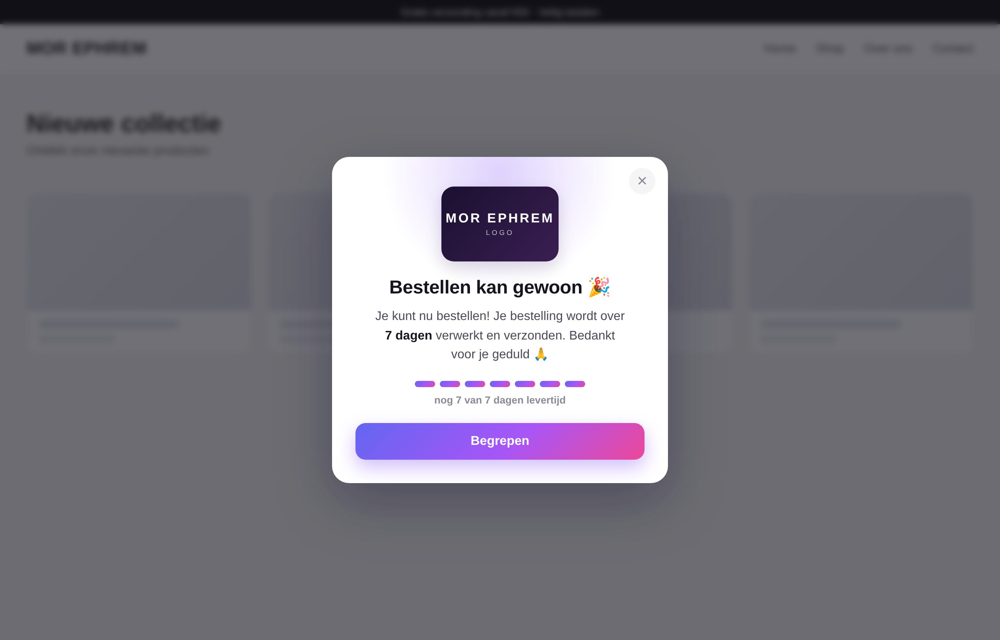

# Bestelmelding-popup — Shopify (logo · afteller · 3s-lock · NL/DE/EN)

Een levendige, zelfstandige pop-up voor de Shopify-winkel **morephrem.shop** die
bezoekers laat weten dat ze gewoon kunnen bestellen, maar dat hun bestelling nog
een aantal dagen levertijd heeft.



## Wat het doet

- **Logo bovenaan** (jouw Shopify-bestand) in plaats van een gekleurde bol.
- **Afteller**: het aantal dagen telt **elke dag automatisch 1 omlaag** vanaf een
  instelbare startdatum, met een voortgangsbalk van gekleurde balkjes. Bij 0
  verdwijnt de pop-up vanzelf. Berekend **server-side in Liquid** (winkel-tijdzone),
  dus altijd correct zonder dat er iets hoeft te draaien.
- **3 seconden leesvergrendeling**: de pop-up is de eerste paar seconden niet weg te
  klikken (knop telt af met een voortgangslijntje, kruisje verschijnt daarna), zodat
  klanten niet per ongeluk wegklikken vóór ze het gelezen hebben.
- **Automatische taal — Nederlands / Duits / Engels** op basis van de browsertaal van
  de klant, met de winkeltaal (`request.locale`) als terugval. Onbekende talen → Engels.
- Verschijnt **één keer per dag per bezoeker**. Toegankelijk (`role="dialog"`,
  `aria-modal`, focus, Esc ná de lock) en respecteert `prefers-reduced-motion`.
  Unieke CSS-prefix `mor7d-`, dus geen thema-conflicten.

## Instellen / aanpassen

Bovenin `delayed-orders-popup.liquid` staat het instelblok:

```liquid
assign show_popup    = true
assign popup_version = 3             # +1 => iedereen ziet 'm vandaag opnieuw
assign logo_url      = 'https://cdn.shopify.com/s/files/1/0929/6668/3005/files/IMG_1979.jpg?v=1784920028'
assign start_date    = '2026-07-24'  # dag waarop de afteller op total_days staat
assign total_days    = 7             # levertijd in dagen op de startdatum
assign lock_seconds  = 3             # seconden dat de pop-up niet weg te klikken is
```

De teksten per taal staan in het `I18N`-blok onderin de snippet (`nl` / `de` / `en`):
titel, bericht (met het dynamische dagenaantal), knop, en de "even lezen"-tekst.

### Afteller-voorbeeld (start 2026-07-24, 7 dagen)

| Datum | Toont |
|---|---|
| 24-07-2026 | 7 dagen |
| 27-07-2026 | 4 dagen |
| 30-07-2026 | 1 dag |
| 31-07-2026 | pop-up verdwijnt (0) |

## Waar het staat (deployment)

Geïnstalleerd via de Shopify Admin GraphQL API op een **kopie** van het live thema
(schrijven naar het live/gepubliceerde thema is via de integratie geblokkeerd):

| | |
|---|---|
| Winkel | morephrem.shop |
| Thema (kopie) | **Webshop — bestelmelding (7 dagen levertijd)** |
| Thema-ID | `187632484733` |
| Snippet | `snippets/delayed-orders-popup.liquid` |
| Inhaak-punt | `layout/theme.liquid`, regel `` vlak vóór `</body>` |

## Publiceren (laatste stap — door de merchant)

De kopie staat klaar maar is nog **niet live**:

1. **Preview:** `https://morephrem.shop/?preview_theme_id=187632484733`
2. Shopify Admin → **Online Store → Themes**.
3. Zoek **"Webshop — bestelmelding (7 dagen levertijd)"** → **Actions → Publish**.

## Verwijderen / terugdraaien

- Snelste weg terug: publiceer opnieuw het originele thema **"Webshop"**.
- Of in dit thema: verwijder `snippets/delayed-orders-popup.liquid` en haal de regel
  `` uit `layout/theme.liquid` weg.
